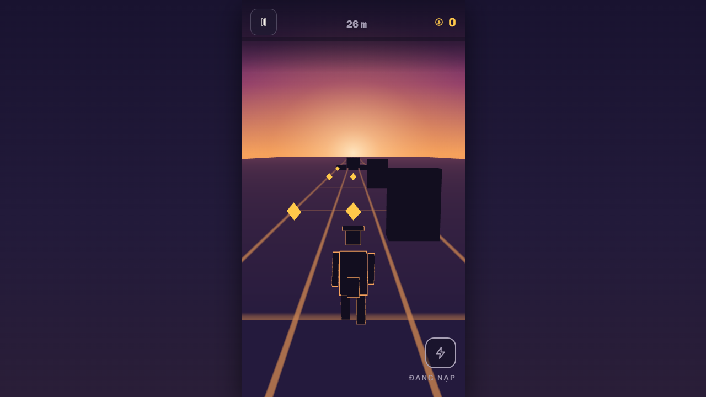

# 🌿 Duck Runner — three lanes across a chasm, and one skill you choose the moment for

[](https://github.com/LeVanAnhDuc/web-game-duck-runner/actions/workflows/ci.yml)
[](https://github.com/LeVanAnhDuc/web-game-duck-runner/actions/workflows/deploy.yml)
[](https://github.com/LeVanAnhDuc/web-game-duck-runner/releases)

A three-lane endless runner, played entirely in the browser. No backend, no account,
no install — open the page and run. Your best distance, your coins and the ducks you
have unlocked live in that browser's `localStorage` and nowhere else.

You run along a stone causeway over a chasm, through dense jungle at first light. One
rule decides how everything is drawn: **anything you must read in a fraction of a
second has a dark body and a bright edge.** A dark background reads the edge, a bright
one reads the body, and no background makes it vanish — coins invert the two layers
because a coin's body is already bright. Danger is encoded by brightness rather than
hue, so it survives every kind of colour blindness, and a test measures all thirteen
pairs on every push. The one silhouette with a warm rim is you.

That rule replaced an earlier one that only held against the sky. Obstacles used to
reach 1.16:1 against the near road — effectively invisible in the last second before
impact — and no rule test could catch it, because the rules were correct.

**Play**: https://levananhduc.github.io/web-game-duck-runner/



## Features

- **Three lanes, three actions.** Change lane, jump the fallen log, duck under the
  hanging vines — which is where the name comes from.
- **A chasm on both sides, and a jungle beyond it.** Trunks scroll past, a leaf canopy
  moves overhead at its own speed, and bright mist fills every gap. The mist is not
  decoration: it is what guarantees every object has a light backdrop to read against,
  at every distance.
- **A charge meter, not a cooldown.** Coins you pick up fill it; when it is full you
  choose the moment to spend it. Coins go to your wallet either way, so using the
  most enjoyable mechanic in the game never costs you progress.
- **One active skill per duck, and they are not ranked against each other.** *Ram*
  smashes through when you are boxed in, *Slow* buys back reaction time when the
  speed has outrun you, *Fly* trades distance for a pass over everything. Equal cost,
  equal duration — so there is no best one, only a right one for the situation.
- **Three power-ups on the road**: magnet, shield, speed rush. Unlike a skill, you do
  not pick the moment — that is the whole distinction.
- **Obstacle clusters that are provably passable.** Every cluster is hand-written
  data, and a solver proves each one can be cleared by running the shipped rules, at
  both speed extremes. A cluster that cannot be cleared turns CI red instead of
  killing a player unfairly.
- **Difficulty that scales with speed while your reaction window stays constant.**
  Spacing is reaction time × current speed, never a fixed distance.
- **Four ducks, told apart by silhouette.** Flat unlit rendering hides colour and
  texture, so identity has to live in proportion and shape: broad, lean, crested,
  capped.
- **Real photography where it earns its place, and nowhere else.** Two public-domain
  images — the far canopy and the menu backdrop — load *after* the first frame, so the
  page is playable before a single image byte arrives, and skip entirely when the
  browser reports data saver. The road texture is drawn in code, because the contrast
  budget caps its amplitude at ±8% and at that amplitude a photograph and a noise
  function are indistinguishable.
- **Sound with no audio files.** Every effect and the music bed are synthesised in the
  browser. The coin pickup rises in pitch across a streak, which a fixed set of files
  could not do.
- **Pause that stops the simulation clock**, so timed effects stop with it rather than
  expiring while you read a menu.
- **Respects `prefers-reduced-motion`**: decoration stops, the run does not.

## Controls

| Action | Keyboard | Touch |
| --- | --- | --- |
| Change lane | `←` `→` · `A` `D` | Swipe left / right |
| Jump | `↑` · `W` | Swipe up |
| Duck (slide) | `↓` · `S` | Swipe down |
| Use skill | `Space` | The button at the bottom right |
| Pause | `Esc` · `P` | The button at the top left |

Neither input is the fallback for the other: both go through one `InputIntent`, so the
rules never learn which one you used. The skill button is an exclusion zone for
gestures — tapping it cannot be read as a swipe, which would otherwise change your
lane every time you used a skill.

## Commands

```bash
npm ci
npm run dev          # http://localhost:5173
npm test             # Vitest — the game rules run in Node, no browser needed
npm run typecheck
npm run lint
npm run build

# Re-measure the coin economy before changing any character price
npx vite-node scripts/measure-economy.ts
```

There is no `.env` to copy: nothing in the code reads an environment variable. See
[`.env.example`](.env.example), which explains that in more detail than an empty file
could.

In a dev build, `window.__duckRunner.stats()` reports fps, draw calls and live object
counts; `__duckRunner.immortal()` and `__duckRunner.warp(seconds)` exist so the densest
scene can be measured without having to survive to it. None of that ships in a
production build.

## How it is put together

Vite · TypeScript · Three.js for the scene · React for the screens only · Vitest.
No audio library and no 3D model files — see the ADRs below for why each of those was
dropped rather than added. Every texture in the 3D scene is drawn with canvas at
startup, which costs 3.9 ms and 3.5 KB gzip.

| Folder | Holds | May depend on |
| --- | --- | --- |
| `src/core/` | loop, input, seeded RNG, simulation clock, event bus | nothing above it |
| `src/game/` | **all game rules, as plain numbers** | `core/`, `data/` |
| `src/data/` | save file, obstacle catalogue, duck catalogue, strings | nothing |
| `src/render/` | Three.js scene, shapes, per-frame sync | `game/` (read-only) |
| `src/audio/` | every sound, synthesised | `data/` |
| `src/ui/` | React screens and the HUD | everything above |

**`src/game/` may not import `three`, touch the DOM, or read the wall clock.** That
boundary is enforced by lint and by a grep in CI, not by convention — it is what lets
the entire rule set be tested in Node, and it is the reason deterministic replay is
possible at all: the same seed and the same input sequence produce the same run, which
catches more gameplay regressions than any other single test here.

Several decisions dropped things the plan had originally included, each for the same
reason — the art direction made them contribute nothing:

- [`ADR-0001`](docs/decisions/0001-dung-three-js-thay-phaser.md) chose Three.js over
  Phaser/PixiJS. Right for a side-view runner; wrong once the camera looks into depth,
  because faking perspective needs front-facing artwork the free 2D packs do not have.
- [`ADR-0008`](docs/decisions/0008-am-thanh-tong-hop-thay-file.md) dropped Howler and
  the audio files. A runner needs four short sounds and a pad, and an oscillator
  produces those exactly.
- [`ADR-0009`](docs/decisions/0009-rung-suong-som-thay-nguoc-sang-hoang-hon.md) replaced
  the original backlit-dusk direction after measuring that its central premise held for
  only half the scene. It supersedes `ADR-0006`, which stays in the repo unedited
  because it is the reasoning behind everything built before it.
- [`ADR-0010`](docs/decisions/0010-anh-cc0-that-tai-sau-frame-dau.md) allows real CC0
  images, but only in the two places they contribute anything, and never on the path to
  the first frame. It supersedes `ADR-0007` while keeping that ADR's argument intact for
  objects in the run: below the horizon what decides legibility is silhouette, so the
  player and the obstacles are still built from primitives.

Image sources and licences: [`docs/assets/CREDITS.md`](docs/assets/CREDITS.md).

## Releases and versioning

Every push to `main` creates a GitHub Release by itself
([`release.yml`](.github/workflows/release.yml)) and deploys to
**<https://levananhduc.github.io/web-game-duck-runner/>**
([`deploy.yml`](.github/workflows/deploy.yml)). Pull requests run lint, tests, a
build, the ADR-0002 boundary check and an audit first
([`ci.yml`](.github/workflows/ci.yml)).

Pages has to be enabled **once per repository** before the first deploy can succeed —
`configure-pages` cannot do it for you, because `GITHUB_TOKEN` is not allowed to
create a Pages site:

```bash
gh api -X POST repos/LeVanAnhDuc/web-game-duck-runner/pages -f build_type=workflow
```

**The version comes from your commit subjects**, so they have to follow Conventional
Commits. The whole range since the previous tag is scanned, so one `feat:` anywhere in
a push is enough for a minor bump — the merge commit's own subject does not need a
prefix.

| In the range since the last tag | Bump |
| --- | --- |
| `feat:` | minor — `v0.4.0` → `v0.5.0` |
| `fix:` · `docs:` · `chore:` · `ci:` · `refactor:` · `test:` · `perf:` | patch — `v0.4.0` → `v0.4.1` |
| `feat!:` (any `type!:`) or a `BREAKING CHANGE` footer | see the 0.x rule below |

**The 0.x rule:** while the major version is `0`, a breaking change bumps the
**minor**, not the major. Nothing is stable before 1.0, and `1.0.0` is a claim about
completeness — so crossing to it takes an explicit marker rather than happening on its
own. The first release of this repo was `v0.1.0` for the same reason.

Three markers, read from **commit subjects across the whole range since the last tag** — not in bodies, because
the bodies here run long and discuss releases, which would otherwise trigger them:

- `[release minor]` / `[release major]` — force a bigger bump. `[release major]` is
  the only way to reach `1.0.0`.
- `[skip release]` — no release for this push. For CI-only changes where a release
  would be noise. Never use it on a push that also carries a `feat:`, or you cancel
  that feature's release too.

Both scripts run locally against the real history, so a release can be previewed
before anyone relies on it:

```bash
npm run release:next     # which tag the next release would get
npm run release:notes    # what its notes would say
```

## Documentation

[`docs/README.md`](docs/README.md) is the map, and the only file that talks about other
files. Read [`docs/03-design/invariants.md`](docs/03-design/invariants.md) before
changing any code — it lists the fourteen things that break **silently**, where the code
still runs and the tests still pass.

Measured performance figures live in
[`docs/02-requirements/nfr.md`](docs/02-requirements/nfr.md), each with the conditions
it was measured under. A number without its conditions would not be reproducible, so
every one of them carries its own.
