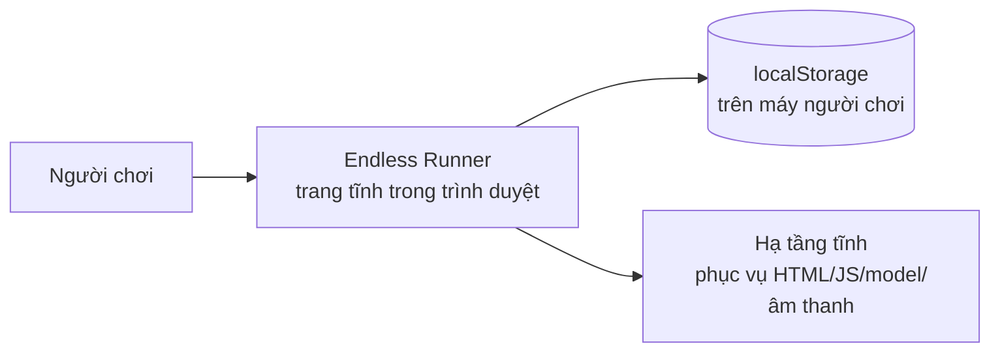
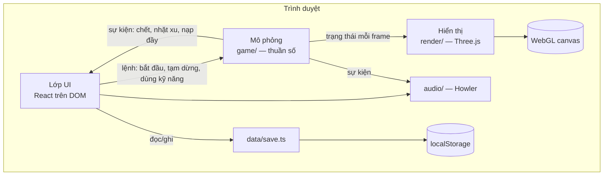

# Kiến trúc

> **Trả lời:** Hệ thống ghép lại thế nào, ranh giới giữa các phần ở đâu?
> **Trạng thái:** 🟢 đủ
> **Cập nhật:** 2026-09-08 · commit —
> **Cập nhật khi:** thêm/bỏ một module hoặc service · đổi cách hai module nói chuyện

<!-- CÁCH ĐIỀN
Mức độ: C4 mức 1 (context) và mức 2 (container). KHÔNG đi xuống class hay function —
đó là code, và code là bản mô tả chính xác nhất của chính nó.

Mục 3 (ranh giới module) là mục AI dùng nhiều nhất: nó quyết định code mới nên đặt
ở đâu. Viết mỗi module một dòng: tên · trách nhiệm một câu · được phép gọi ai.

Mục 5 chỉ ghi TÊN công nghệ + số ADR. LÝ DO chọn nằm trong ADR, không nằm đây —
nếu lý do bị chép vào đây thì hai bản sẽ lệch.

KHÔNG chứa: lý do chọn công nghệ (-> decisions/), bất biến (-> invariants.md),
schema chi tiết (-> file schema của ORM), danh sách chức năng (-> 02-requirements/scope.md).
-->

## 1. Context — hệ thống nằm giữa ai với ai

Không có máy chủ ứng dụng, không có API, không có cơ sở dữ liệu từ xa — xem
`01-product/overview.md` §Non-Goals.

## 2. Container — hệ thống gồm những khối chạy được nào

Mũi tên từ `SIM` sang `REN` chỉ đi một chiều: hiển thị đọc mô phỏng, mô phỏng không
bao giờ hỏi hiển thị. Mũi tên `SIM → UI` là sự kiện rời rạc, không phải trạng thái
mỗi frame — HUD tự đọc trạng thái qua ref, xem `invariants.md` §7.

## 3. Module và ranh giới

| Module | Trách nhiệm một câu | Được phép gọi | **Không** được gọi |
| --- | --- | --- | --- |
| `core/loop` | Vòng lặp bước cố định: gọi mô phỏng đúng nhịp, gọi render với hệ số nội suy | `game/` · `render/` | — |
| `core/input` | Gom vuốt và phím thành một `InputIntent` duy nhất | DOM events | `game/` · `render/` |
| `core/rng` | Sinh số ngẫu nhiên có seed, tái lập được | — | mọi thứ khác |
| `core/events` | Kênh sự kiện rời rạc từ mô phỏng ra ngoài | — | mọi thứ khác |
| `game/Game` | Điều phối một lượt chơi | `game/*` · `core/rng` · `core/events` | **`three`** · `render/` · `ui/` · DOM |
| `game/Player` | Vị trí trên trục làn, nhảy, trượt, trạng thái bất tử | `core/rng` | như trên |
| `game/Track` | Đường chạy: các đoạn tái sử dụng, cuộn về phía camera | `core/rng` | như trên |
| `game/Spawner` | Chọn pattern chướng ngại/xu theo độ khó hiện tại | `core/rng` · `data/patterns` | như trên |
| `game/Collision` | Kiểm tra chồng lấn AABB trên toạ độ mô phỏng | — | như trên |
| `game/ActiveEffects` | Mọi hiệu ứng có thời hạn, dù nguồn là power-up hay kỹ năng | `core/events` | như trên |
| `game/Scoring` | Điểm theo quãng đường và xu | — | như trên |
| `render/Scene` | Camera, ánh sáng, sương mù, tỉ lệ khung hình | `three` · `game/` (chỉ đọc) | `ui/` · `data/` |
| `render/Models` | Tải `.glb`, cache, dựng instance | `three` | `game/` (ghi) |
| `render/Effects` | Hiệu ứng trang trí: vệt tốc độ, particle, rung camera | `three` | `game/` (ghi) |
| `audio/Audio` | Phát và tắt âm, nhớ trạng thái tắt tiếng | `howler` · `data/save` | `game/` · `render/` |
| `data/save` | Đọc/ghi/validate/migrate trạng thái lưu | `localStorage` | `game/` · `render/` · `ui/` |
| `data/catalog` | Danh mục nhân vật, kỹ năng và giá — **dữ liệu, không phải code** | — | mọi thứ khác |
| `data/patterns` | Catalog pattern chướng ngại — dữ liệu | — | mọi thứ khác |
| `ui/screens` | Các màn hình React ngoài lúc chơi | `data/*` · `core/events` | `three` · `render/` |
| `ui/hud` | Lớp phủ lúc chơi, cập nhật qua ref | `core/events` | `three` · `render/` |

Ranh giới quan trọng nhất là dòng **`game/` không được import `three`**. Nó là điều
kiện để toàn bộ luật chơi test được trong Node. Xem `ADR-0002` và `invariants.md` §4.

## 4. Luồng dữ liệu của đường đi quan trọng nhất

Một bước mô phỏng, tức là đường đi mà mọi thứ khác đi theo:

1. `core/loop` tích luỹ thời gian trôi qua; mỗi khi đủ một bước cố định thì chạy tiếp.
2. `core/input` trả `InputIntent` hiện tại — đổi làn, nhảy, trượt, dùng kỹ năng — đã
   gom chung từ cảm ứng và bàn phím.
3. `game/Game` đẩy mô phỏng đi một bước: `Player` cập nhật vị trí thật trên trục làn;
   `Track` cuộn; `Spawner` quyết định có sinh cụm mới không dựa trên tốc độ hiện tại;
   `ActiveEffects` giảm bộ đếm theo **thời gian mô phỏng**; `Collision` kiểm tra chồng
   lấn theo **vị trí thật**; `Scoring` cộng điểm.
4. Sự kiện rời rạc (nhặt xu, nạp đầy, trúng chướng ngại, chết) đi qua `core/events`
   tới `audio/` và `ui/hud`.
5. `core/loop` gọi `render/Scene` với hệ số nội suy giữa bước trước và bước hiện tại;
   `render/` đọc trạng thái mô phỏng và cập nhật vị trí các object trong cảnh.
6. Khi lượt kết thúc, `game/Game` phát một sự kiện; `ui/` hiện màn kết thúc và gọi
   `data/save` ghi một lần duy nhất.

## 5. Tech stack

| Lớp | Công nghệ | Biện minh |
| --- | --- | --- |
| Dựng và đóng gói | Vite + TypeScript | — |
| Hiển thị 3D | Three.js | ADR-0001 |
| Ranh giới mô phỏng / hiển thị | quy ước import, kiểm bằng lint | ADR-0002 |
| Lớp UI | React trên DOM, không react-three-fiber | ADR-0003 |
| Nhân vật và kỹ năng | dữ liệu trong `data/catalog` | ADR-0004 |
| Tỉ lệ khung hình | khoá góc nhìn theo chiều dọc | ADR-0005 |
| Âm thanh | Howler | — |
| Mô hình 3D | bộ low-poly CC0 của Kenney, định dạng `.glb` | ADR-0001 |
| Kiểm thử | Vitest cho `game/` · Playwright cho luồng UI | ADR-0002 |
| Lưu trữ | `localStorage`, một key có version | — |
